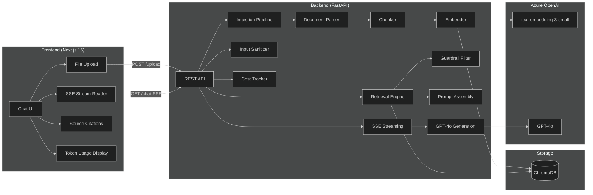

# ContextReader

**Chat with your documents using AI-powered Retrieval-Augmented Generation.**

[Quick Start](#quick-start) · [Architecture](#architecture) · [API Reference](#api-reference) · [Deployment](#deployment) · [Contributing](CONTRIBUTING.md)

## Overview

ContextReader is a full-stack **Retrieval-Augmented Generation (RAG)** application that lets users upload documents (PDF, DOCX, TXT) and have natural language conversations with their content.
Every answer is grounded in your documents with **inline source citations**, so you always know where the information comes from.

### Key Features

- **Multi-format document ingestion** — Upload PDF, DOCX, and TXT files.
- **Intelligent chunking** — Documents are split into semantically meaningful chunks using recursive character splitting.
- **Vector search with ChromaDB** — Fast similarity retrieval with persistent storage.
- **Streamed AI responses** — Real-time token-by-token streaming via Server-Sent Events (SSE).
- **Inline source citations** — Every answer references the exact document chunks it was derived from.
- **Retrieval guardrails** — Low-confidence results are filtered out to prevent hallucination.
- **Prompt injection detection** — Input sanitization protects against adversarial queries.
- **Token usage and cost tracking** — Per-request visibility into API consumption.
- **Prompt versioning** — System prompts are versioned files, enabling A/B testing and iteration.
- **Structured logging** — JSON logs with request IDs, latency, token counts, and guardrail events.

## Architecture



### Pipeline Flow

```text
Upload → Parse (PyMuPDF / python-docx) → Chunk (1000 chars, 200 overlap)
→ Embed (text-embedding-3-small) → Store (ChromaDB)
→ Query → Retrieve top 5 → Guardrail (L2 ≤ 0.75) → Stream GPT-4o → Citations
```

## Tech Stack

| Layer | Technology | Purpose |
| --- | --- | --- |
| **Frontend** | Next.js 16, TypeScript, Tailwind CSS | App Router, SSE streaming, responsive UI |
| **Backend** | Python 3.11+, FastAPI | Async REST API, document pipeline |
| **Embeddings** | Azure OpenAI `text-embedding-3-small` | Document and query embedding |
| **Generation** | Azure OpenAI `GPT-4o` | Streamed answer generation |
| **Vector Store** | ChromaDB (persistent) | Similarity search and retrieval |
| **Containerization** | Docker, Docker Compose | Reproducible dev and prod environments |

## Project Structure

```text
context-reader/
├── backend/
│   ├── main.py              # FastAPI app, routes, CORS
│   ├── ingestion.py         # Document parsing, chunking, embedding
│   ├── retrieval.py         # ChromaDB query, guardrail logic
│   ├── streaming.py         # SSE streaming handler
│   ├── evaluation.py        # Retrieval precision logging
│   ├── cost_tracker.py      # Token usage and cost per request
│   ├── sanitizer.py         # Prompt injection detection
│   ├── prompts/             # Versioned system prompt templates
│   │   ├── v1_system.txt
│   │   └── v2_system.txt
│   ├── tests/               # pytest unit tests
│   └── logs/                # Structured JSON logs
├── frontend/
│   ├── app/                 # Next.js App Router pages
│   ├── components/
│   │   ├── ChatWindow.tsx   # Chat interface with streaming
│   │   ├── FileUpload.tsx   # Document upload with validation
│   │   ├── SourceCitation.tsx  # Inline citation display
│   │   └── TokenUsage.tsx   # Token and cost display
│   └── lib/
│       └── api.ts           # API client (fetch + SSE)
├── docs/
│   ├── ARCHITECTURE.md     # System design and technical decisions
│   ├── DEPLOYMENT.md        # Deployment and environment setup
│   └── PROJECT_PLAN.md      # Roadmap, milestones, dev checklist, and future improvements
├── docker-compose.yml
└── README.md
```

## Quick Start

### Prerequisites

- [Python 3.11+][python]
- [Node.js 18+][node]
- [Docker][docker] and Docker Compose (optional)
- An [Azure OpenAI][azure-openai] resource with `GPT-4o` and `text-embedding-3-small` deployments

### 1. Clone the Repository

```bash
git clone https://github.com/dileepadev/context-reader.git
cd context-reader
```

### 2. Configure Environment Variables

```bash
cp backend/.env.example backend/.env
cp frontend/.env.example frontend/.env
```

Edit `backend/.env` with your Azure OpenAI credentials:

```env
AZURE_OPENAI_API_KEY=your-api-key
AZURE_OPENAI_ENDPOINT=https://your-resource.openai.azure.com/
AZURE_OPENAI_DEPLOYMENT_NAME=gpt-4o
AZURE_OPENAI_EMBEDDING_DEPLOYMENT=text-embedding-3-small
AZURE_OPENAI_API_VERSION=2024-02-01
```

### 3a. Run with Docker (Recommended)

```bash
docker-compose up --build
```

The app will be available at:

- **Frontend**: <http://localhost:3000>
- **Backend API**: <http://localhost:8000>
- **API Docs**: <http://localhost:8000/docs>

### 3b. Run Locally (Without Docker)

**Backend:**

```bash
cd backend
python -m venv .venv
source .venv/bin/activate
pip install -r requirements.txt
uvicorn main:app --reload --port 8000
```

**Frontend:**

```bash
cd frontend
npm install
npm run dev
```

### 4. Health Check

```bash
curl http://localhost:8000/health
```

## API Reference

| Method | Endpoint | Description |
| --- | --- | --- |
| `GET` | `/health` | Health check |
| `POST` | `/upload` | Upload a document (PDF, DOCX, TXT) |
| `GET` | `/chat` | Chat with documents (SSE stream) |
| `GET` | `/documents` | List uploaded documents |

### Upload a Document

```bash
curl -X POST http://localhost:8000/upload \
  -F "file=@document.pdf"
```

### Chat with Documents

```bash
curl -N http://localhost:8000/chat?query=What+is+the+main+topic
```

The response streams as Server-Sent Events with token-by-token output and source citations.

## Environment Variables

| Variable | Required | Description |
| --- | --- | --- |
| `AZURE_OPENAI_API_KEY` | Yes | Azure OpenAI API key |
| `AZURE_OPENAI_ENDPOINT` | Yes | Azure OpenAI resource endpoint |
| `AZURE_OPENAI_DEPLOYMENT_NAME` | Yes | GPT-4o deployment name |
| `AZURE_OPENAI_EMBEDDING_DEPLOYMENT` | Yes | text-embedding-3-small deployment name |
| `AZURE_OPENAI_API_VERSION` | Yes | API version (e.g., `2024-02-01`) |
| `CHROMA_PERSIST_DIR` | No | ChromaDB storage path (default: `./chroma_db`) |
| `SIMILARITY_THRESHOLD` | No | L2 distance cutoff (default: `0.75`) |
| `MAX_INPUT_LENGTH` | No | Max query character length (default: `1000`) |
| `ACTIVE_PROMPT_VERSION` | No | System prompt version (default: `v1`) |
| `LOG_LEVEL` | No | Logging level (default: `INFO`) |

## Testing

### Backend Tests

```bash
cd backend
python -m pytest tests/ -v
```

### Frontend Lint and Type Check

```bash
cd frontend
npm run lint
npx tsc --noEmit
```

## Deployment

See [DEPLOYMENT.md](docs/DEPLOYMENT.md) for detailed deployment instructions covering:

- Local development setup
- Docker Compose deployment
- Azure OpenAI resource configuration
- Production considerations

## Project Documentation

| Document | Description |
| --- | --- |
| [docs/README.md](docs/README.md) | Documentation index and recommended reading order |
| [PROJECT_PLAN.md](docs/PROJECT_PLAN.md) | Delivery phases, detailed checklist, release gate, and backlog |
| [ARCHITECTURE.md](docs/ARCHITECTURE.md) | System design and technical decisions |
| [DEPLOYMENT.md](docs/DEPLOYMENT.md) | Deployment and environment setup |
| [CONTRIBUTING.md](CONTRIBUTING.md) | How to contribute |
| [CHANGELOG.md](CHANGELOG.md) | Release history |
| [BRANCH_NAMING_GUIDELINES.md](BRANCH_NAMING_GUIDELINES.md) | Branch naming conventions |
| [COMMIT_MESSAGE_GUIDELINES.md](COMMIT_MESSAGE_GUIDELINES.md) | Commit message conventions |
| [PULL_REQUEST_GUIDELINES.md](PULL_REQUEST_GUIDELINES.md) | Pull request structure and review checklist |
| [ISSUE_TEMPLATE](.github/ISSUE_TEMPLATE) | Standardized issue templates for bugs, docs, and feature requests |
| [PULL_REQUEST_TEMPLATE.md](.github/PULL_REQUEST_TEMPLATE.md) | Default pull request template used on GitHub |
| [SECURITY.md](SECURITY.md) | Security policy |
| [VERSIONING.md](VERSIONING.md) | Versioning strategy |
| [CODE_OF_CONDUCT.md](CODE_OF_CONDUCT.md) | Community guidelines |
| [AGENTS.md](AGENTS.md) | Agent workflow and repository-specific coding instructions |

## License

This project is licensed under the [MIT License](LICENSE).

## Contact

Dileepa Bandara

- Email: [contact@dileepa.dev](mailto:contact@dileepa.dev)
- GitHub: [@dileepadev](https://github.com/dileepadev)

[python]: https://www.python.org/downloads/
[node]: https://nodejs.org/
[docker]: https://docs.docker.com/get-docker/
[azure-openai]: https://learn.microsoft.com/azure/ai-services/openai/
